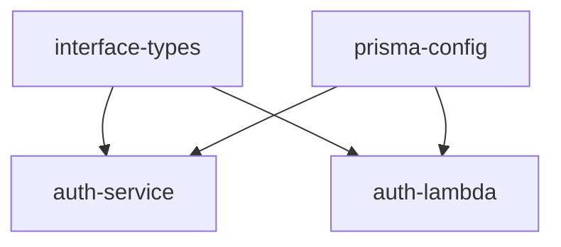
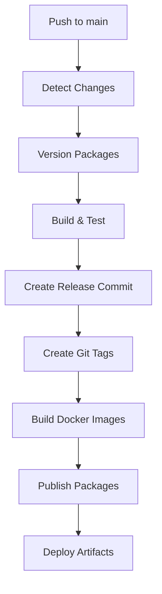

# 🏦 TrustHive - Open Source Banking Platform


A modern, scalable microservices-based banking platform built with TypeScript, featuring automated CI/CD, containerization, and enterprise-grade architecture patterns.

## 🏗️ Architecture Overview

TrustHive is designed as a monorepo using advanced tooling and patterns to manage complexity while maintaining scalability:

### 📁 Project Structure

```
TrustHive/
├── auth/                           # Authentication microservices
│   ├── service/                    # Express.js REST API service
│   │   ├── src/                    # TypeScript source code
│   │   ├── build/                  # Compiled JavaScript output
│   │   ├── Dockerfile              # Container image definition
│   │   ├── build.js                # Custom esbuild configuration
│   │   └── package.json            # Service dependencies & scripts
│   └── lambda/                     # AWS Lambda functions
│       ├── src/                    # TypeScript source code
│       ├── build/                  # Compiled output + ZIP artifacts
│       ├── build.js                # Lambda-optimized build script
│       └── package.json            # Lightweight Lambda dependencies
├── common/                         # Shared packages
│   ├── interface/                  # TypeScript type definitions
│   │   ├── src/                    # Interface definitions
│   │   ├── dist/                   # Compiled type declarations
│   │   └── package.json            # Published as @trusthive/interface-types
│   └── prisma/                     # Database layer
│       ├── src/                    # Database utilities & services
│       ├── schema.prisma           # Database schema definition
│       ├── migrations/             # Database migration history
│       └── package.json            # Published as @trusthive/prisma-config
├── .github/workflows/              # CI/CD automation
├── scripts/                        # Build & deployment utilities
├── lerna.json                      # Monorepo configuration
└── turbo.json                      # Build orchestration
```

## 🛠️ Technology Stack

### Core Technologies
- **TypeScript** - Type-safe development across all services
- **Node.js 18** - Runtime environment
- **PostgreSQL** - Primary database with Prisma ORM
- **Docker** - Containerization for services
- **AWS Lambda** - Serverless functions for specific use cases

### Build & Development Tools
- **Turborepo** - High-performance build orchestration
- **Lerna** - Independent versioning and release management
- **ESBuild** - Ultra-fast bundling for production
- **ESLint** - Code quality and consistency
- **Prisma** - Type-safe database client and migrations

### CI/CD & Infrastructure
- **GitHub Actions** - Automated workflows
- **GitHub Container Registry** - Docker image storage
- **GitHub Package Registry** - NPM package hosting

## 🔧 How It All Works Together

### 1. Monorepo Management with Turborepo + Lerna

**Turborepo** handles build orchestration:
```bash
yarn build    # Builds packages in dependency order with caching
yarn lint     # Lints all packages in parallel
yarn test     # Runs tests across all packages
```

**Lerna** manages independent versioning:
```bash
yarn lerna:version    # Smart versioning based on changes
yarn lerna:list       # List service versions (excludes common packages)
yarn lerna:publish    # Publish packages to registry
```

### 2. Shared Package Architecture

#### Interface Types (`@trusthive/interface-types`)
Central type definitions shared across all services:
```typescript
// In any service
import { LoginRequest, ApiResponse, User } from '@trusthive/interface-types';
```

#### Prisma Configuration (`@trusthive/prisma-config`)
Centralized database layer with services and utilities:
```typescript
// In any service
import { UserService, DatabaseUtils, prisma } from '@trusthive/prisma-config';

// Use pre-built service methods
const user = await UserService.findUserByEmail('user@example.com');

// Or use Prisma client directly
const accounts = await prisma.account.findMany({ where: { userId } });
```

### 3. Smart Build System

#### Service-Specific Builds
- **Auth Service**: Uses esbuild to bundle into `build/` directory for Docker
- **Auth Lambda**: Creates optimized ZIP file (`auth-lambda.zip`) for AWS deployment
- **Common Packages**: Generate TypeScript declarations and JavaScript modules

#### Build Dependencies


### 4. Docker Integration

#### Multi-Stage Docker Build (auth-service)
```dockerfile
FROM node:18-alpine AS base
# Install production dependencies
COPY package*.json ./
RUN yarn install --production

# Copy built application
COPY build ./build/

# Security: non-root user
USER trusthive
EXPOSE 3000
CMD ["node", "build/index.js"]
```

#### Container Features:
- 🔒 **Security**: Non-root user execution
- ⚡ **Performance**: Multi-stage builds for minimal image size
- 🏥 **Health Checks**: Built-in health monitoring
- 📦 **Dependencies**: Only production packages included

### 5. Database Architecture

#### Centralized Schema Management
All database models are defined in `common/prisma/schema.prisma`:
```prisma
model User {
  id        String   @id @default(cuid())
  email     String   @unique
  accounts  Account[]
  // ... more fields
}

model Account {
  id            String        @id @default(cuid())
  userId        String
  balance       Decimal       @default(0)
  user          User          @relation(fields: [userId], references: [id])
  // ... more fields
}
```

#### Service Layer Abstraction
Pre-built service classes for common operations:
```typescript
// UserService.ts
export class UserService {
  static async createUser(data: Prisma.UserCreateInput): Promise<User> {
    return prisma.user.create({ data, include: { accounts: true } });
  }
  
  static async findUserByEmail(email: string): Promise<User | null> {
    return prisma.user.findUnique({ where: { email } });
  }
}
```

### 6. Intelligent Versioning Strategy

#### Lerna's Smart Version Management

**When services change independently:**
```bash
# Only auth-service modified
git commit -m "feat(auth-service): add new endpoint"
yarn lerna:version
# Result: Only auth-service gets version bump (1.0.0 → 1.1.0)
```

**When common packages change:**
```bash
# Interface types modified
git commit -m "feat(interface): add new user type"
yarn lerna:version
# Result: ALL services get version bump (interface affects all)
```

#### Version Outputs:
```
🚀 TrustHive Microservices:

┌─────────────────────────────────────────────────────────────┐
│                       Service Versions                     │
├─────────────────────────────────────────────────────────────┤
│ auth-lambda          │ v1.2.0      │ auth/lambda          │
│ auth-service         │ v1.2.0      │ auth/service         │
└─────────────────────────────────────────────────────────────┘
```

## 🚀 CI/CD Pipeline

[](https://github.com/anuragbhatt1805/TrustHive/actions/workflows/pr-validation.yml)
[](https://github.com/anuragbhatt1805/TrustHive/actions/workflows/release.yml)

### 1. Pull Request Validation


### 2. Automated Release Process


### 3. Deployment Outputs

#### Docker Images
- **Registry**: `ghcr.io/anuragbhatt1805/trusthive-auth-service`
- **Tags**: `latest`, `v1.2.0`, `v1.1.0`...
- **Features**: Multi-platform, security-scanned, optimized

#### Lambda Artifacts
- **Format**: Deployment-ready ZIP files
- **Size**: Optimized (<2KB typical)
- **Retention**: 7 days in GitHub Actions artifacts
- **Contents**: Bundled code with minimal dependencies

#### NPM Packages
- **Registry**: GitHub Package Registry
- **Packages**: `@trusthive/interface-types`, `@trusthive/prisma-config`
- **Consumption**: Available for import in any service

## 💻 Development Workflow

### 1. Setup
```bash
# Clone repository
git clone https://github.com/anuragbhatt1805/TrustHive.git
cd TrustHive

# Install dependencies
yarn install

# Setup database
cd common/prisma
npx prisma migrate dev
npx prisma generate
```

### 2. Development Commands
```bash
# Start development server
cd auth/service && yarn dev

# Run quality checks (same as CI)
yarn check-types && yarn lint

# Build all packages
yarn build

# Check what will be versioned
yarn lerna:changed

# List current versions
yarn lerna:list
```

### 3. Adding New Services
```bash
# Create new service directory
mkdir -p payments/service

# Add to workspace in package.json
"workspaces": [..., "payments/service"]

# Add to lerna.json packages
"packages": [..., "payments/*"]

# Service automatically included in build pipeline
```

## 🔐 Security Features

- **🛡️ Container Security**: Non-root users, minimal attack surface
- **🔒 Database Security**: Parameterized queries, connection pooling
- **📡 API Security**: CORS configuration, input validation
- **🔑 Secrets Management**: GitHub repository secrets integration
- **🏥 Health Monitoring**: Built-in health checks and monitoring

## 📊 Monitoring & Observability

- **📈 Build Metrics**: Turbo cache performance, build times
- **🐳 Container Metrics**: Image sizes, health status
- **📦 Package Metrics**: Bundle sizes, dependency analysis
- **🔄 Version Tracking**: Git tags, release history

## 🎯 Future Roadmap

- [ ] **Testing Framework**: Jest integration with coverage reporting
- [ ] **API Documentation**: OpenAPI/Swagger specification
- [ ] **Monitoring**: Prometheus metrics and Grafana dashboards  
- [ ] **Security**: Dependabot, security scanning, OWASP compliance
- [ ] **Performance**: Load testing, performance budgets
- [ ] **Deployment**: Kubernetes manifests, Helm charts
- [ ] **Observability**: Distributed tracing, structured logging

## 🏃‍♂️ Quick Start

```bash
# 1. Setup environment
git clone https://github.com/anuragbhatt1805/TrustHive.git
cd TrustHive && yarn install

# 2. Start database
docker run --name trusthive-db -p 5432:5432 \
  -e POSTGRES_PASSWORD=12345678 -e POSTGRES_DB=trusthive \
  -d postgres:15

# 3. Setup database schema
cd common/prisma && npx prisma migrate dev

# 4. Start services
yarn build && cd auth/service && yarn start
```

## 📚 Documentation

- [`VERSIONING.md`](./VERSIONING.md) - Versioning strategy and commands
- [`CI-CD.md`](./CI-CD.md) - Detailed CI/CD pipeline documentation
- [`BUILD_STATUS.md`](./BUILD_STATUS.md) - Build status and artifacts

## 🤝 Contributing

1. Fork the repository
2. Create a feature branch (`git checkout -b feature/amazing-feature`)
3. Commit using conventional commits (`git commit -m 'feat: add amazing feature'`)
4. Push to the branch (`git push origin feature/amazing-feature`)
5. Open a Pull Request

Pull requests must pass all CI checks including type checking, linting, and builds.

## 📄 License

This project is licensed under the MIT License - see the [LICENSE](LICENSE) file for details.

## 👨‍💻 Creator

**Anurag Bhatt**  
📧 Email: [anuragbhatt1805@gmail.com](mailto:anuragbhatt1805@gmail.com)  
👔 Role: DevOps + Backend Engineer  

*Passionate about building scalable, maintainable, and secure financial technology solutions using modern development practices and cloud-native architectures.*

---

<div align="center">
  <strong>🏦 TrustHive - Banking Made Simple, Secure, and Scalable</strong>
</div>
