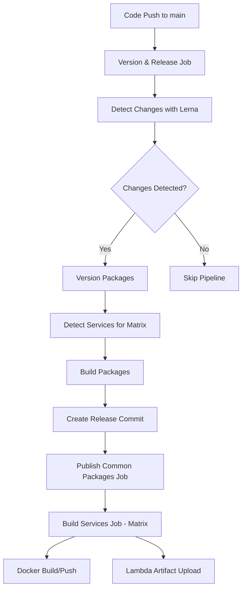

# TrustHive CI/CD Architecture

## Overview

The TrustHive CI/CD pipeline has been designed to be fully scalable and dynamic, automatically detecting and building services without requiring manual configuration changes to the workflow files.

## Architecture Components

### 1. Dynamic Service Detection

The workflow automatically detects services based on:
- **File structure**: Presence of `package.json` files outside the `common/` directory
- **Service type**: Determined by project artifacts:
  - `Dockerfile` → Docker service
  - `archiver` or `aws-lambda` dependencies → Lambda service
  - `serverless.yml/yaml` → Serverless service
  - Default → Library

### 2. Build Pipeline Flow



### 3. Package Publishing Order

1. **Common Packages** (libraries): `@anuragbhatt1805/trusthive-interface-types`, `@anuragbhatt1805/trusthive-prisma-config`
2. **Services**: Docker images and Lambda artifacts

### 4. Service Configuration

Services are automatically configured based on the `services.config.json` file and project structure:

```json
{
  "services": {
    "auth": {
      "services": [
        {
          "name": "@anuragbhatt1805/trusthive-auth-service",
          "path": "auth/service",
          "type": "docker"
        },
        {
          "name": "@anuragbhatt1805/trusthive-auth-lambda",
          "path": "auth/lambda",
          "type": "lambda"
        }
      ]
    }
  }
}
```

## Adding New Services

To add new services, simply:

1. **Create the service directory structure:**
   ```
   new-category/
   ├── service/
   │   ├── package.json
   │   ├── Dockerfile (for Docker services)
   │   └── src/
   └── lambda/
       ├── package.json (with archiver dependency for Lambda)
       └── src/
   ```

2. **Configure package.json:**
   ```json
   {
     "name": "@anuragbhatt1805/trusthive-new-service",
     "version": "1.0.0",
     "private": false,
     "publishConfig": {
       "registry": "https://npm.pkg.github.com"
     }
   }
   ```

3. **The workflow will automatically:**
   - Detect the new service
   - Include it in the build matrix
   - Build Docker images or Lambda artifacts
   - Publish to the appropriate registry

## Key Features

### ✅ Fully Dynamic
- No hardcoded service names in workflows
- Automatic service type detection
- Matrix builds for parallel processing

### ✅ Package Dependency Management
- Ensures common packages are published before services
- Waits for package availability before Docker builds
- Retry mechanism for transient failures

### ✅ Proper Error Handling
- Non-blocking failures for optional packages
- Timeout mechanisms for package availability
- Graceful degradation

### ✅ Future-Proof
- Easy to extend for new service types
- Supports multiple deployment targets
- Configurable through `services.config.json`

## Troubleshooting

### Docker Build Failures
The Docker build includes retry mechanisms for package installation:
- Waits up to 10 minutes for packages to become available
- Retries package installation up to 10 times
- Uses proper `.npmrc` configuration for GitHub Package Registry

### Adding New Categories
When adding services in new directories (e.g., `payment/`, `notification/`):
1. Follow the same structure as `auth/`
2. Ensure `package.json` has proper naming convention: `@anuragbhatt1805/trusthive-{service-name}`
3. Set `"private": false` to include in builds

### GitHub Actions Matrix Limitations
- Maximum 256 jobs per matrix (we're well within limits)
- JSON formatting is handled with heredoc syntax to avoid escaping issues
- Service detection outputs properly formatted JSON for matrix consumption

## Configuration Files

- **`services.config.json`**: Central configuration for service management
- **`.github/workflows/release.yml`**: Main CI/CD pipeline
- **`scripts/test-service-detection.sh`**: Local testing script for service detection logic

This architecture ensures that the TrustHive platform can scale from the current 2 services to dozens of services without any manual intervention in the CI/CD configuration.
